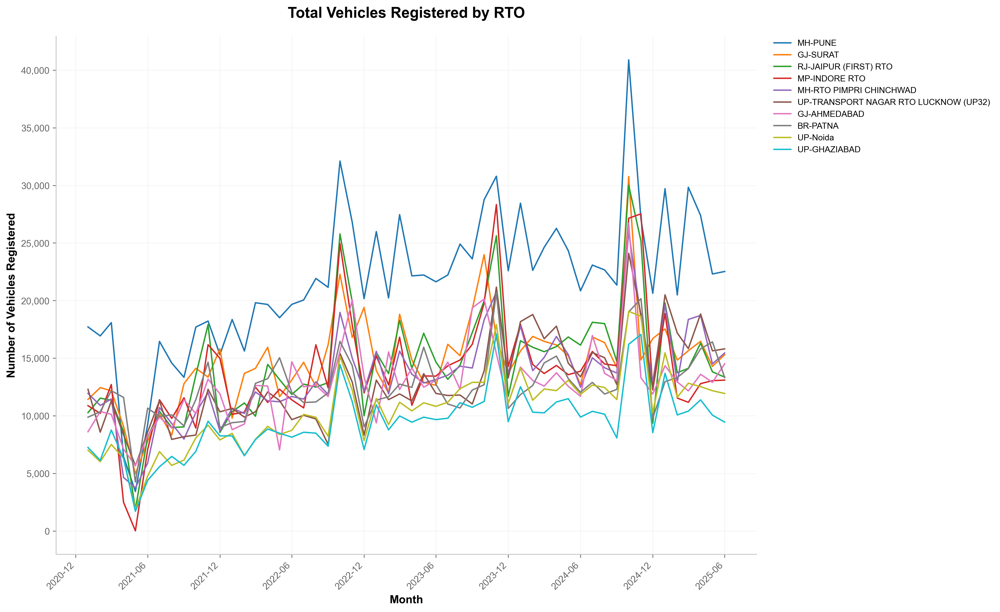
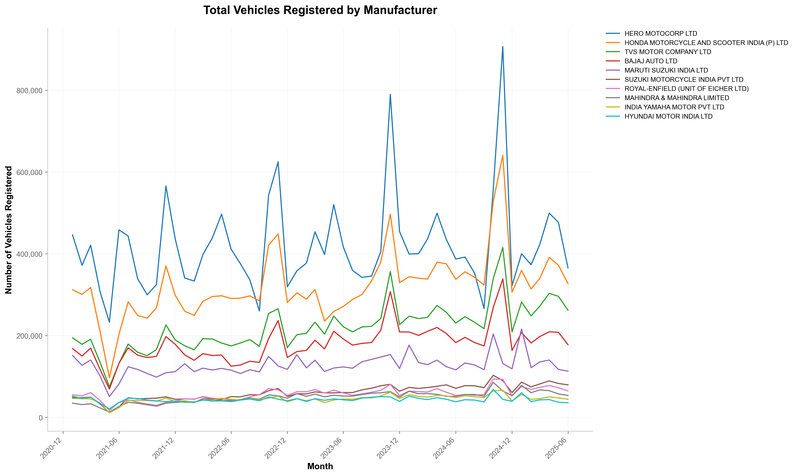

# india-vehicle-stats

Dataset of vehicle permit, registration, revenue and transaction statistics for India. Sourced from [Parivahan Vahan Sewa](https://vahan.parivahan.gov.in/vahan4dashboard/).

Explore the dataset [here](https://india-vehicle-stats.pages.dev)

## Data

* [vehicle-statistics.parquet](data/vehicle-statistics.parquet): Vehicle permit, registration, revenue and transaction statistics, as Parquet file.
* [vehicle-statistics.csv.gz](https://github.com/Vonter/india-vehicle-stats/releases/latest/download/vehicle-statistics.csv.gz): Vehicle permit, registration, revenue and transaction statistics, as compressed CSV file.

For more details, refer to the [DATA.md](DATA.md).

## Visualizations

#### Top RTOs by vehicle registration



#### Top manufacturers by vehicle registration



#### Explorer

The code for the [Explorer](https://india-vehicle-stats.pages.dev) website is available in [viz/](viz/).

## Scripts

- [fetch.py](fetch.py) Fetches the raw HTMLs for the vehicle statistics
- [parse.py](parse.py): Parses the raw HTMLs to generate the Parquet and compressed CSV dataset
- [data.py](data.py): Generates the data JSONs for the data Explorer website
- [viz.py](viz.py): Generates the visualizations PNGs from the Parquet dataset

## License

This india-vehicle-stats dataset is made available under the Open Database License: http://opendatacommons.org/licenses/odbl/1.0/. 
Some individual contents of the database are under copyright by Ministry of Road Transport & Highways, India.

You are free:

* **To share**: To copy, distribute and use the database.
* **To create**: To produce works from the database.
* **To adapt**: To modify, transform and build upon the database.

As long as you:

* **Attribute**: You must attribute any public use of the database, or works produced from the database, in the manner specified in the ODbL. For any use or redistribution of the database, or works produced from it, you must make clear to others the license of the database and keep intact any notices on the original database.
* **Share-Alike**: If you publicly use any adapted version of this database, or works produced from an adapted database, you must also offer that adapted database under the ODbL.
* **Keep open**: If you redistribute the database, or an adapted version of it, then you may use technological measures that restrict the work (such as DRM) as long as you also redistribute a version without such measures.

## Generating

Ensure that `python` and the required dependencies in `requirements.txt` are installed.

```
# Fetch the raw HTMLs
python fetch.py

# Parse the raw HTMLs
python parse.py

# Generate the JSONs
python data.py

# Generate the PNGs
python viz.py
```

## TODO

- Fetch data from other Views available on Vahan Sewa:
    - Summary View
    - Tabular Summary
- Automatically refetch RTO metric combinations for failed fetches or missing counts
- Refetch historical data regularly to reduce inconsistencies in older data

## Credits

- [Parivahan Vahan Sewa](https://vahan.parivahan.gov.in/vahan4dashboard/)

## AI Declaration

Components of this repository, including code and documentation, were written with assistance from Claude AI.
